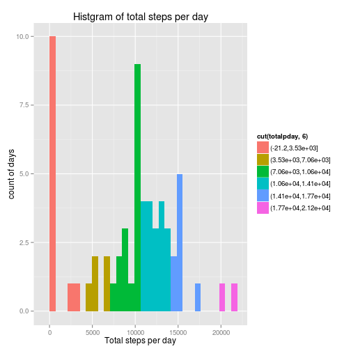
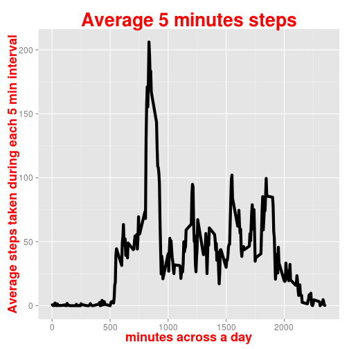
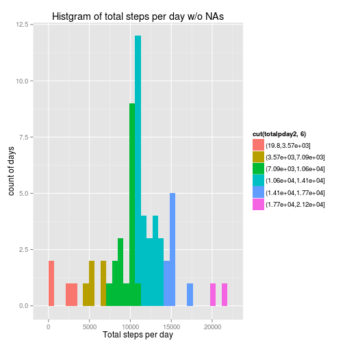
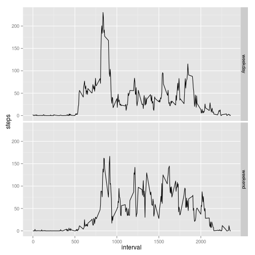

```r
echo = TRUE  # Always make code visible
options(scipen = 1)  # Turn off scientific notations for numbers
```


#Reproducible research peer assignment 1

Load necessary packages

```r
library(lubridate)
library(ggplot2)
```


Read in the data store in "df" and change "steps" to numeric and "date" to date classes

```r
getwd()
```

```
## [1] "/home/li"
```

```r
df<-read.csv("activity.csv")
df[,2]<-ymd(df[,2])
df[,1]<-as.numeric(df[,1])
```

##What is mean total number of steps taken per day?

```r
#Total number taken per day
totalpday<-tapply(df[,1], yday(df[,2]), sum, na.rm=TRUE)
#Plot histgram
qplot(totalpday, main="Histgram of total steps per day", xlab="Total steps per day", ylab="count of days", fill=cut(totalpday,6))
```

 

```r
#report the mean of total number of steps taken per day
summary(totalpday)
```

```
##    Min. 1st Qu.  Median    Mean 3rd Qu.    Max. 
##       0    6778   10400    9354   12810   21190
```


##What is the average daily activity pattern?

```r
avg<-tapply(df[,1], df[,3], mean, na.rm=TRUE)
avgdf<-data.frame("min"=as.numeric(names(avg)), avgsteps=avg)
p2<-ggplot(avgdf, aes(x=min, y=avgsteps))
p2<-p2+geom_line(size=2)+xlab("minutes across a day")+ylab("Average steps taken during each 5 min interval")+ggtitle("Average 5 minutes steps")+theme(axis.text=element_text(size=12),axis.title=element_text(size=18,face="bold"), title=element_text(size=22,face="bold", colour="red"))
p2
```

 

```r
#The interval with highest step number
maxmin<-names(avg)[avg==max(avg)]
```
The 5 min interval with most steps (206.1698113) is 835


##Imputing missing values

```r
totalna<-sum(is.na(df[,1]))
```

1. The total number of missing values in the dataset is 2304
2. Filling in all of the missing values in the dataset by using mean for that 5-minute interval. And the new data sets with NA replaced is "df2"

```r
df2<-df
for(i in 1:nrow(df2)){
  if(is.na(df2[i,1])){
    df2[i,1]<-avg[df[i,3]==names(avg)]
  }
}
```
3. Make a histogram of the total number of steps taken each day and Calculate and report the mean and median total number of steps taken per day. 

```r
#Total number taken per day
totalpday2<-tapply(df2[,1], yday(df2[,2]), sum)
#Plot histgram
qplot(totalpday2, main="Histgram of total steps per day w/o NAs", xlab="Total steps per day", ylab="count of days", fill=cut(totalpday2,6))
```

 

```r
#report the mean of total number of steps taken per day
summary(totalpday2)
```

```
##    Min. 1st Qu.  Median    Mean 3rd Qu.    Max. 
##      41    9819   10770   10770   12810   21190
```
4. Do these values differ from the estimates from the first part of the assignment? What is the impact of imputing missing data on the estimates of the total daily number of steps?

```r
compare<-rbind(summary(totalpday), summary(totalpday2))
rownames(compare)<-c("with NAs", "without NAs")
compare
```

```
##             Min. 1st Qu. Median  Mean 3rd Qu.  Max.
## with NAs       0    6778  10400  9354   12810 21190
## without NAs   41    9819  10770 10770   12810 21190
```
Both median and mean increase after filling in NAs

##Are there differences in activity patterns between weekdays and weekends?
1.Create a new factor variable in the dataset with two levels – “weekday” and “weekend” indicating whether a given date is a weekday or weekend day.

```r
df2$wday<-wday(df2[,2])
convert<-function(num){
  if(num>=2 & num<=6){return("weekday")}
  else if(num==1||num==7){return("weekend")}
  else{stop("input is out of range")}
}
df2$wdaychr<-sapply(df2$wday, convert)
```
1.Make a panel plot containing a time series plot (i.e. type = "l") of the 5-minute interval (x-axis) and the average number of steps taken, averaged across all weekday days or weekend days (y-axis). 

```r
df2wd<-split(df2, df2$wdaychr)[[1]]
df2we<-split(df2, df2$wdaychr)[[2]]
avg2wd<-tapply(df2wd[,1], df2wd[,3], mean)
avg2we<-tapply(df2we[,1], df2we[,3], mean)
wd<-cbind(unique(df2[,3]), avg2wd, rep("weekday", length(avg2wd)))
we<-cbind(unique(df2[,3]), avg2we, rep("weekend", length(avg2we)))
df3<-rbind(wd,we)
df3<-as.data.frame(df3,stringsAsFactors=FALSE)
names(df3)<-c("interval", "steps", "day")
df3$steps<-as.numeric(as.character(df3$steps))
df3$interval<-as.numeric(as.character(df3$interval))

p3<-ggplot(df3, aes(x=interval, y=steps))
p3+geom_line()+facet_grid(day~.)
```

 

